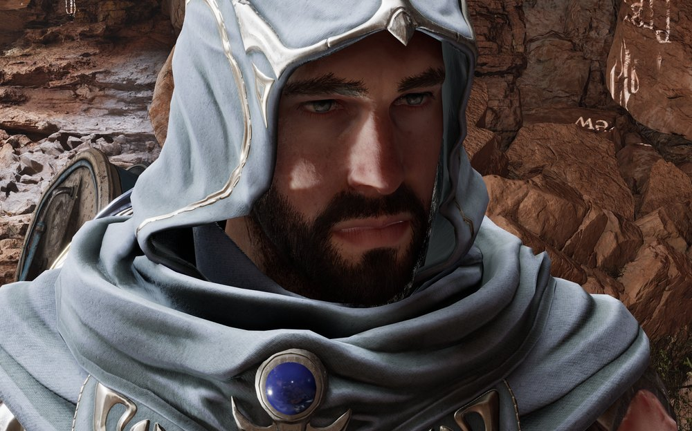
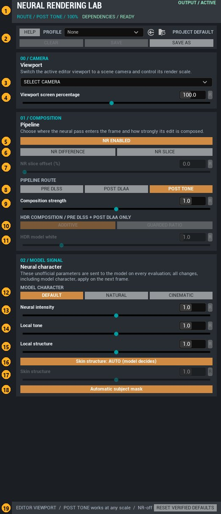

# DLSS5-OneMinus: DLSS 5 v8.8.0 for Unreal

This plugin brings the **DLSS 5 neural rendering (NR)** model into Unreal Engine as an optional post pass. It builds on NVIDIA's **DLSS 4.5 v8.8.0** Unreal plugin, which provides NGX, Super Resolution and DLAA, and adds:
- the **Neural Rendering Lab** editor panel;
- reusable profiles and a level settings actor;
- Blueprint nodes and Movie Render Queue support.

Win64 / DirectX 12 · Unreal Engine 5.5 – 5.8

| NR off | NR on |
|---|---|
|  |  |

UE 5.8.3, Post Tone route, composition 1.0, style Default, skin structure AUTO. Same frame, NR toggled.

**Full guide:** [powtwoxovery.github.io/DLSS5-OneMinus/Docs/DLSS5OneMinus_Help.html](https://powtwoxovery.github.io/DLSS5-OneMinus/Docs/DLSS5OneMinus_Help.html). It covers every control with annotated screenshots, an interactive before/after, and how the routes work. It is also packaged with the plugin as [`Docs/DLSS5OneMinus_Help.html`](Docs/DLSS5OneMinus_Help.html), and the panel's **HELP** button opens it.

## Pick your Unreal version

Each engine version has its own branch and release, validated on the stock launcher engine.

| Unreal Engine | Branch | Release | Base: NVIDIA DLSS 4.5 plugin |
|---|---|---|---|
| 5.5 | [`ue5.5`](https://github.com/powtwoxovery/DLSS5-OneMinus/tree/ue5.5) | [`v0.1.0-ue5.5`](https://github.com/powtwoxovery/DLSS5-OneMinus/releases/tag/v0.1.0-ue5.5) | v8.8.0 for UE 5.5 |
| 5.6 | [`ue5.6`](https://github.com/powtwoxovery/DLSS5-OneMinus/tree/ue5.6) | [`v0.1.0-ue5.6`](https://github.com/powtwoxovery/DLSS5-OneMinus/releases/tag/v0.1.0-ue5.6) | v8.8.0 for UE 5.6 |
| 5.7 | [`ue5.7`](https://github.com/powtwoxovery/DLSS5-OneMinus/tree/ue5.7) | [`v0.1.0-ue5.7`](https://github.com/powtwoxovery/DLSS5-OneMinus/releases/tag/v0.1.0-ue5.7) | v8.8.0 for UE 5.7 |
| 5.8 | [`ue5.8`](https://github.com/powtwoxovery/DLSS5-OneMinus/tree/ue5.8) | [`v0.1.0-ue5.8`](https://github.com/powtwoxovery/DLSS5-OneMinus/releases/tag/v0.1.0-ue5.8) | v8.8.0 for UE 5.8 |

Each release passed the same checks:
- every panel control;
- all three NR routes and screen percentage;
- the Difference and Slice views;
- Play in Editor and a Movie Render Queue render.

## What we don't supply

| Dependency | Where from |
|---|---|
| **NVIDIA DLSS 4.5 v8.8.0 Unreal plugin**, for your exact engine version | https://developer.nvidia.com/rtx/dlss. Install it into `<YourProject>/Plugins/NVIDIA/`. |
| **DLSS 5 NR runtime payload** | Not distributed. The plugin checks its SHA-256 at startup and stays disabled without it. |

This repository contains no NVIDIA code, headers or binaries.

## Install

1. Clone the branch for your engine (for example `ue5.8`) into `<YourProject>/Plugins/DLSS5-OneMinus`.
2. Enable **DLSS5-OneMinus** and NVIDIA **DLSS** in the project's plugin list, then rebuild.
3. Open **Tools → Neural Rendering Lab**, or run the console command `DLSSNR.Controls`, and turn NR on.

NR is off by default in editor and game worlds. You can turn it on from:
- the panel;
- a **DLSS5-OneMinus Settings** level actor;
- the Blueprint nodes (`Apply Profile`, `Set Neural Rendering Enabled`);
- the **DLSS5-OneMinus Neural Rendering** Movie Render Queue setting.

## The panel

Three routes decide where NR runs:

| Route | Where NR runs | Screen % while NR is on | HDR composition settings |
|---|---|---|---|
| Post Tone (default) | After tonemapping, SDR | 10–200% | not used |
| Pre DLSS | Before DLSS Super Resolution | 33–99% | used |
| Post DLAA | After native DLAA | 100% | used |

Your requested screen percentage is kept. Routes only constrain what's rendered while NR is on. Controls that don't apply in the current context are greyed, and their values stay visible.

## Console

`r.NGX.DLSSNR.Enable`, `.Path`, `.Strength` (0–2), `.HDRComposition`, `.WhitePoint`, `.Style`, `.Intensity`, `.LocalToneStrength`, `.LocalStructureStrength`, `.SkinStructureStrength` (-1 = auto), `.AutoMask`, `.DebugView`, `.SliceOffsetPercent`, `.AllowSceneCaptures`

Commands: `DLSSNR.Controls`, `DLSSNR.DebugDifference`, `DLSSNR.DebugSlice`, `DLSSNR.Validate*`
